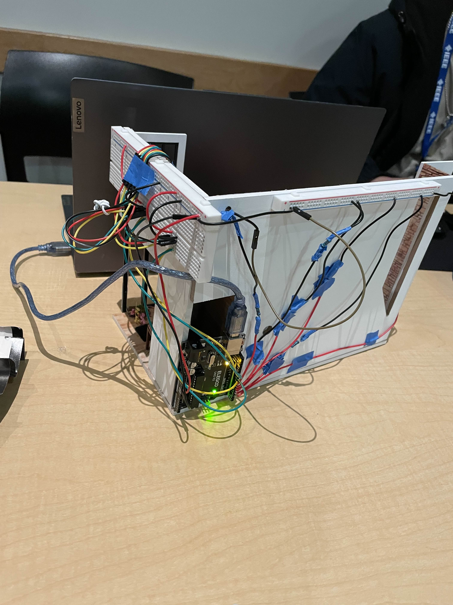
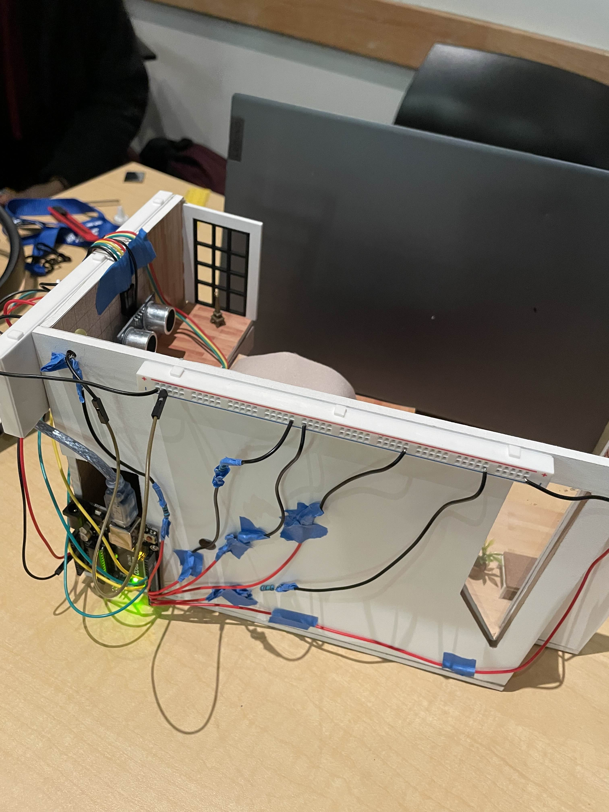

# Documentation

## What problem does our design solve?

Homes consume unnecessary energy when lights and appliances remain active without occupants present. This wasteful practice contributes to:

- **Climate Crisis**: Energy production increases greenhouse gas emissions
- **Light Pollution**: Excessive lighting disrupts ecosystems and wildlife behavior
- **Health Impact**: Unnecessary lighting affects human sleep patterns and well-being
- **Wasted Costs**: Homeowners pay for energy they don't use

Our solution creates energy-efficient homes that only consume power when needed, reducing environmental impact while saving costs.

## How do we plan to solve the problem:

Our smart system manages electrical appliances by supplying only the minimum power needed, prioritizing efficiency over constant consumption.

**Key Features:**

- **Smart Monitoring**: Ultrasonic sensors detect room occupancy
- **Automated Control**: Arduino Uno microcontroller manages smart lighting, activating LEDs only when necessary
- **Warm-Tone LEDs**: Produces warm-colored light that reduces light pollution, protecting wildlife and human health while being more energy-efficient
- **Optimized Usage**: Reduces artificial light emissions by intelligently managing LEDs based on real-time conditions

This approach minimizes energy waste while maintaining comfortable living conditions.

## Parts list and why:

- **6 Yellow LEDs and 6 1.5K Ohm Resistors**: Create warm light colors to reduce blue light exposure and minimize disruption to sleep patterns and wildlife. Resistors protect and dim LEDs to maintain energy efficiency.
- **Two Ultrasonic Sensors**: Detect room occupancy by emitting sound waves and measuring reflection time, enabling the system to determine when someone enters or leaves a room. Each sensor controls 3 LEDs for localized lighting zones.
- **Arduino UNO**: Central microcontroller that processes sensor data in real-time and manages LED activation based on occupancy detection.

## Circuit Diagram:

## Pictures:

## AI-generated code obstacles

- **Circuit Design Limitations**: AI tools demonstrated limited effectiveness in circuit design tasks, particularly due to their inability to visualize circuit diagrams and spatial component relationships.
- **Hardware-Specific Knowledge Gaps**: AI exhibited difficulty providing accurate guidance for newer hardware platforms such as the Arduino Uno Q, often confusing it with other Arduino board variants due to limited training data on recent hardware releases.
- **Complex Debugging Challenges**: AI proved ineffective when troubleshooting multi-input connectivity issues, such as interfacing microphones and cameras through USB-C dongles to the Arduino Uno Q, requiring extensive manual intervention.
- **Response Verification Required**: AI-generated solutions frequently contained inaccuracies and hallucinations, necessitating thorough inspection and validation of all provided code and recommendations before implementation.
